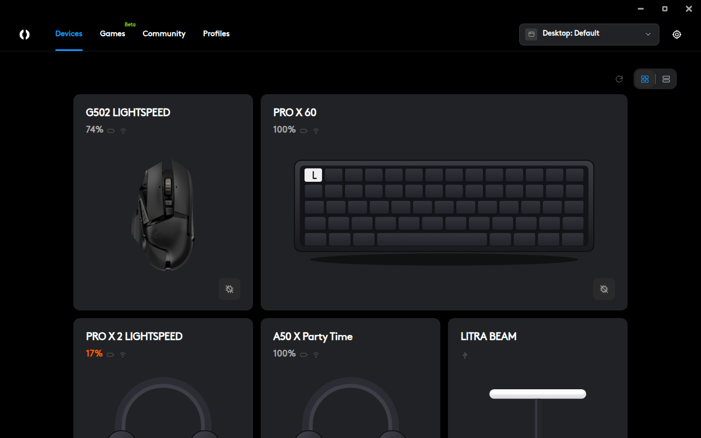

<p align="center">
  
</p>

<h1 align="center">OpenGHub</h1>

<p align="center">
  Logitech G HUB for Linux — open source, native, no kernel module.<br>
  DPI, polling rate, LIGHTSYNC, button assignments, macros, on-board profiles, racing wheels with force feedback, Lua scripting and firmware updates, in the interface you already know.
</p>

<p align="center">
  <a href="https://github.com/Slyvan25/OpenGHub/releases/latest"></a>
  <a href="https://github.com/Slyvan25/OpenGHub/actions/workflows/ci.yml"></a>
  <a href="LICENSE"></a>
</p>

<p align="center">
  
</p>

---

OpenGHub talks to Logitech peripherals directly over **HID++ 2.0** through `hidraw`, the way G HUB does on Windows — so the things the device itself supports work exactly as they do there, and the things G HUB does in software are done here in userspace. Built with Tauri 2, Svelte 5 and Rust.

## Install

Grab the package for your distribution from the [latest release](https://github.com/Slyvan25/OpenGHub/releases/latest).

| Distribution | Package | Install |
| --- | --- | --- |
| Debian, Ubuntu, Mint, Pop!_OS | `OpenGHub_x.y.z_amd64.deb` | `sudo apt install ./OpenGHub_*_amd64.deb` |
| Fedora, openSUSE, RHEL | `OpenGHub-x.y.z-1.x86_64.rpm` | `sudo dnf install ./OpenGHub-*.rpm` |
| Arch, Manjaro, EndeavourOS | `PKGBUILD` | `makepkg -si` in a folder with the PKGBUILD (AUR: `openghub-bin`) |
| Flatpak (any distribution) | `OpenGHub_x.y.z.flatpak` | `flatpak install --user OpenGHub_*.flatpak` |
| Anything else | `OpenGHub_x.y.z_amd64.AppImage` | `chmod +x OpenGHub_*.AppImage && ./OpenGHub_*.AppImage` |

The .deb and .rpm install the udev rule that lets you talk to the devices. The Flatpak, the AppImage and a build from source offer to install it the first time you start the app — your desktop asks for your password once, nothing else to configure. Details in [docs/permissions.md](docs/permissions.md).

Optional, for the LIGHTSYNC software effects: `gstreamer1.0-tools` + `gstreamer1.0-pipewire` (screen sampler) and `pulseaudio-utils` (audio visualizer).

## What you get

- **Devices** — every HID++ 2.0 device is discovered automatically, wired, over Bluetooth or behind a LIGHTSPEED / Unifying / Bolt receiver, with its battery, firmware and the exact renders and button/zone geometry G HUB uses (fetched from Logitech's public CDN at runtime, never bundled).
- **Sensitivity** — DPI stages, default and shift stage, polling rate up to 8 kHz.
- **Assignments** — drag commands, keys, system actions or macros onto any button, with G-Shift as a second layer and a guard that never leaves you without a primary click. Applied live through the button spy and written to the device's on-board memory so they survive without the app.
- **Macros** — G HUB's three-step editor, written to on-board memory with a backup first.
- **LIGHTSYNC** — per-zone fixed / breathing / colour cycle on the device, plus a screen sampler and an audio visualizer streamed from the app.
- **Profiles** — per game, switched automatically when the game runs; rename, duplicate, disable; import your existing G HUB `settings.db`; share and install community profiles.
- **Games** — a launcher that finds Steam, Heroic (Epic / GOG) and Lutris libraries.
- **Racing wheels** — G923 and its relatives: operating range, centering spring, sensitivity, pedal curves, RPM LEDs, centre calibration, and a userspace force-feedback driver so games get real FFB. TrueForce works under Proton. A *gamepad mode* makes the wheel show up as an Xbox controller for games without wheel support (Rocket League, say).
- **Lua scripting** — G HUB's scripting API (`OnEvent`, `PressKey`, `OutputLogMessage`, …) per profile; scripts written for G HUB run unchanged.
- **Firmware** — release notes and version checks from Logitech's own firmware packages, and updates over the standard HID++ DFU sequence.
- **Everything else** — tray menu, launch at startup, start minimised, low-battery mode, sleep timers, left-handed layout, on-board memory mode.

## Tested hardware

Developed against a **G502 LIGHTSPEED** (mouse features, on-board memory, lighting, macros, scripting) and a **G923 Racing Wheel** (PS4/PC edition: force feedback, TrueForce, shifter, pedals, gamepad mode). Any other HID++ 2.0 device should work for the features it exposes — the app reads the device's own feature list and adapts. If yours doesn't, open an issue with the output of *Device settings → HID++ features*.

## Games and Proton

Native games and anything through SDL see OpenGHub's virtual wheel with full force feedback. Proton routes Logitech wheels over hidraw by default (that is what lets TrueForce reach the wheel); to give a Proton game the driver's wheel *and* keep TrueForce, launch it with `PROTON_DISABLE_HIDRAW=0x046d/0xc266 %command%`. The [wheel notes](docs/wheels.md) explain the trade-offs.

## Where things live

| | Path |
| --- | --- |
| Configuration (profiles, settings) | `~/.config/openghub/config.json` |
| Device renders, layouts, firmware packages, backups | `~/.local/share/openghub/` |
| udev rule | `/etc/udev/rules.d/70-openghub.rules` (installed by the package or from the app) |
| Launch at startup | `~/.config/autostart/openghub.desktop` |

## Building from source

```sh
# Debian/Ubuntu: sudo apt install libwebkit2gtk-4.1-dev libayatana-appindicator3-dev librsvg2-dev libudev-dev libssl-dev build-essential pkg-config patchelf
# Fedora:        sudo dnf install webkit2gtk4.1-devel libayatana-appindicator-gtk3-devel librsvg2-devel systemd-devel openssl-devel gcc patchelf
npm install
npm run tauri dev            # against your hardware
npm run tauri build          # .deb, .rpm and AppImage in src-tauri/target/release/bundle
```

Rust 1.77+ and Node 20+. `npm run dev` serves the interface in a browser against a mock backend, handy for UI work without hardware. Tests: `cargo test --lib` in `src-tauri`, `npm run check` for the frontend. More in [docs/development.md](docs/development.md).

## Documentation

- [Device permissions and startup](docs/permissions.md)
- [HID++ and the device layer](docs/hidpp.md) — protocol, on-board memory, remapping, G-Shift, device settings, firmware
- [Racing wheels](docs/wheels.md) — the classic command channel, the FFB driver, pedals, TrueForce, Proton
- [Lighting and artwork](docs/lighting.md) — zones, software effects, where the renders come from
- [Profiles, games and scripting](docs/profiles.md) — per-game profiles, community profiles, G HUB import, Lua
- [Developing](docs/development.md)
- [Publishing on Flathub](docs/flathub.md)

## Contributing

Issues and pull requests are welcome. Community profiles live in a separate repository, [openghub-community](https://github.com/Slyvan25/openghub-community), one JSON file per profile under a CC0 licence; the app's *Share…* menu exports the file for you.

Please don't contribute Logitech's own files (artwork, firmware, databases): the app fetches what it needs from Logitech's public CDN at runtime, and the repository stays clean.

## Trademarks and licence

OpenGHub is not affiliated with or endorsed by Logitech. G HUB, LIGHTSPEED, LIGHTSYNC and TrueForce are trademarks of Logitech.

Released under the [MIT licence](LICENSE).
